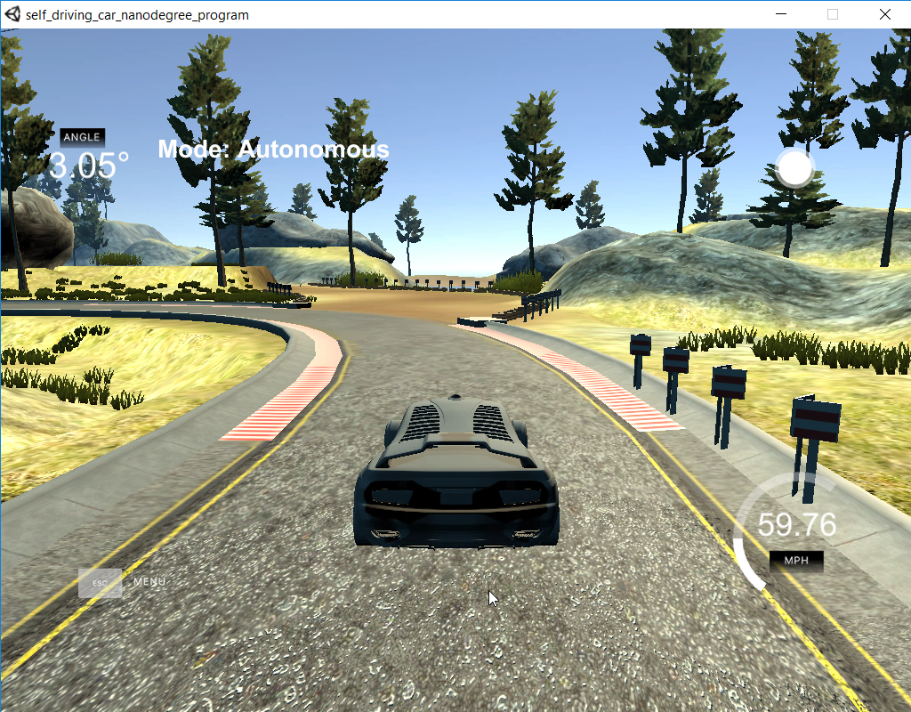

# PID Controller Project
## Self-Driving Car Engineer Nanodegree Program

### Tom Chmielenski
#### March 2018

----

In this project, I successfully implemented a PID Controller in C++ to autonomous steer the vehicle around the Term 2 simulator track.  In addition, I implemented a simple P Controller to maintain a constant speed as the vehicle manipulated around the track.

A PID Controller is a control loop feedback mechanism which continously calculates an error value as the difference between a desired setpoint and a measured process variable and applies a correction based on proportional (P), integral (I), and derivative (D) terms.

Source: [Wikipedia](https://en.wikipedia.org/wiki/PID_controller)

The Proprotional (P) term controls how the vehicle will steer in proportion to the Cross Track Error (CTE).  The CTE is how far in the y direction the vehicle is from the reference trajectory along it's x-axis.  By adjusting the Proportional (P) term, we can cause the vehicle to steer back towards the center.  However, if we were to just implement the Proportional term, the car will overshoot the reference trajectory and will oscillate back and forth around the reference trajectory.  This oscillation would cause the occupants of the vehicle to become sick and is undesirable.

The Derivative (D) term is the derivative of cross track error over time.  It contols how much the vehicle should countersteer to help minimize the oscillation.  So as the CTE error becomes smaller over time, this term allows the vehicle to gracefully approach its targeted trajectory.    

The Integral(I) term is the sum of all the cross track errors observed over time.  This term helps to overcome any systematic bias, such as a misalignment in the vehicle's alignment.

By tuning these three terms properly, we can provide implement a smooth vehicle motion which prevents our vehicle's occupants from getting seasick while riding in our vehicle.

 

Source: [Udacity CarND Term2: Lession 17:Section 12: PID Implementation Solution](https://classroom.udacity.com/nanodegrees/nd013/parts/40f38239-66b6-46ec-ae68-03afd8a601c8/modules/f1820894-8322-4bb3-81aa-b26b3c6dcbaf/lessons/1397890f-71c5-4d83-aae7-0a031eedd1f2/concepts/db31b93d-6741-4e5c-b63c-fa6dd5c170ff)

---
To tune the Steering PID Controller, I manually tuned it by following these steps.
1.  Set Ki, Kd values to zero.  Increase Kp until the vehicle oscillates.
2.  With Kp fixed, change Kd and slowly increase Kd.
3.  Tune both Kp and Kd, to minimize the vehicles osciallations.
4.  Increase Ki until any offset is corrected. 
5.  Once the steering PID controller, implement a second pid to control the throttle.

These steps were discussed in the [Udacity Forums]( https://discussions.udacity.com/t/car-veering-off/312738/11)

---

Here are the steps I took to manually tune this controller:

### Steering PID

|  Kp | Ki   | Kd  | Speed  | Status | Vehicle behavior | Comments |
|---|---|---|---|---|---|---|
| 1.00| 0.00  | 0  |  30| Unsuccessful |Vehicle immediately started oscallating and vearing off to right | Standard 'P' Controller
| -0.50 | 0.00  | -0.50   | 30 | Unsuccessful | Starting point from Project Review video  | Realized Kp should be negative
| -0.25 | 0.00  | -0.50  | 30  |  Unsuccessful | | Increase Kp, experimenting
| -0.25 | 0.00  | -0.75  | 30  |  Unsuccessful | | Descrease Kp, experimenting
|  -0.20 | 0.00  | -5.00  | 30  | Successful | First time completing a lap  | Read Kd should be at least 4x Kp
|  -0.20 | 0.00  | -5.00  | 50  |  Successful |  Oscillates too much back and forth across the lane.| Increased speed to 50 |
|  -0.20 | 0.00  | -10.00  | 50  | Success | Similar to last iteration| No significant difference to kd=-5.00  |
|  -0.20 | 0.0002  | -5.00  | 50  |Success| Slightly better, osciallate at the end of the first lap | Revert Kd=-5, add in Ki |
|  -0.20 | 0.00002  | -5.00  | 50  | Unsuccessful | Lost control need end of first lap | vary Ki |
|  -0.10 | 0.0002  | -5.00  | 50  | Successful | | revert Ki =0.0002, tweak Kp |
|  -0.15 | 0.0002  | -5.00  | 50  |  Successful | | tweaking Kp|
|  -0.15 | 0.00002  | -5.00  | 50   | Successful| | tweaking Ki|
|  -0.15 | 0.00002  | -5.00  | 60  | Successful | Barely, touches edge of lane | try increasing speed to 60
|  -0.15 | 0.0003  | -5.00  | 55  | Successful | Slightly better, still too close to edge of lane | reduce speed, increase Ki slightly
|  -0.15 | 0.00003  | -5.00  | 60  | Successful| Not much difference in behavior | Increase speed to 60, decrease Ki |
|  -0.15 | 0.00003  | -5.00  | 30  | Successful| Same behavior at lower speed  |  Verify still working at lower speed of 30

I settled on the following parameters for my steering PID controller:

    Kp = -0.15
    Ki = 0.00003
    Kd = -5.00

One I had tuned the Steering PID controller, I chose to implement a simple Throttle
P controller as well.  After starting with a small initial Kp starting value, the vehicle speed was surprisely constant, so there was no need to modify the Kd and Ki values.  

    Kp = -0.10
    Ki =  0.00
    Kd =  0.00

After implementing both controllers, the vehicle navigated the course correctly at least 3 laps with a target speed up to 65 mph.  Here is a video showing the final results, with a constant speed of 59 mph.

---

---